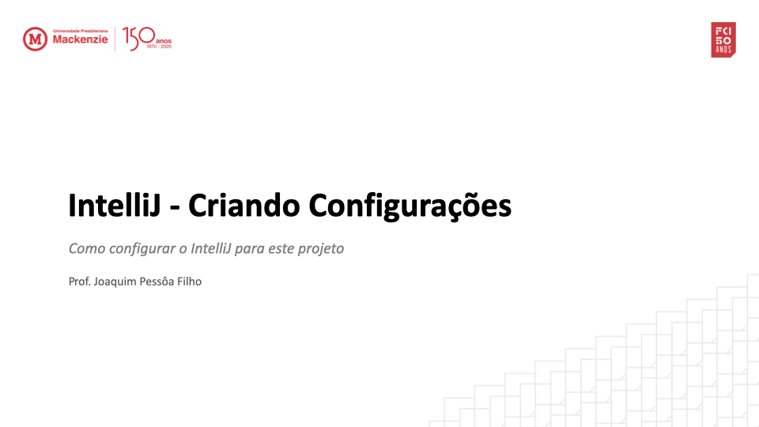
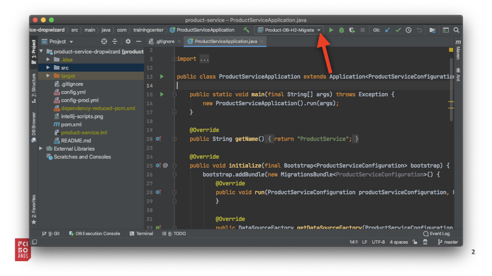
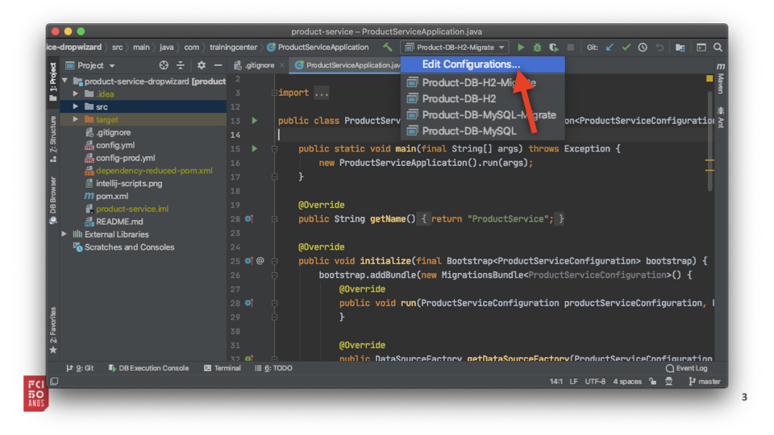
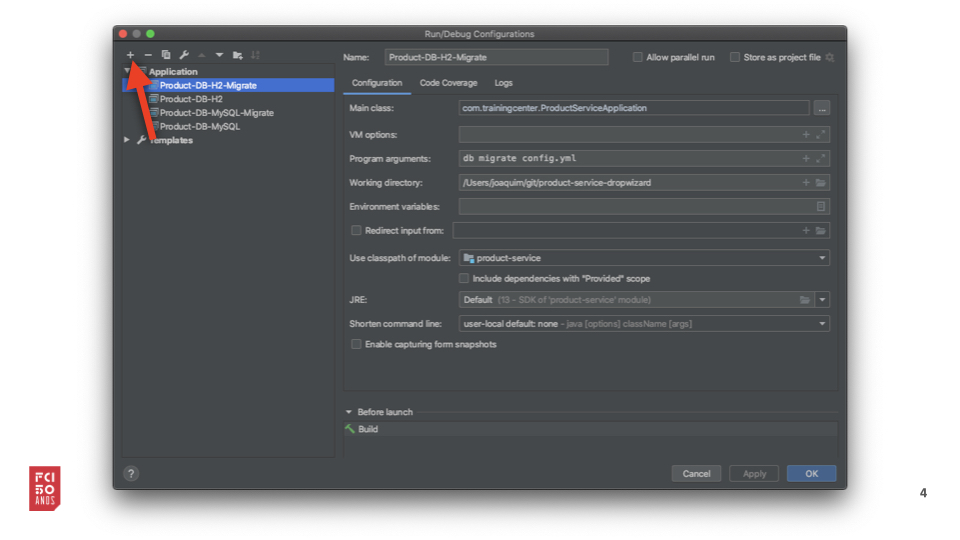
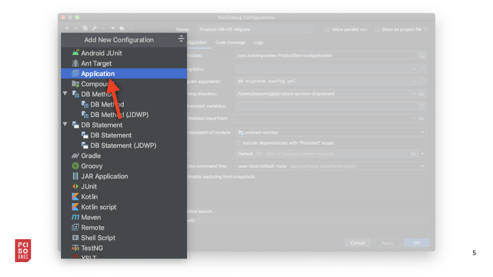
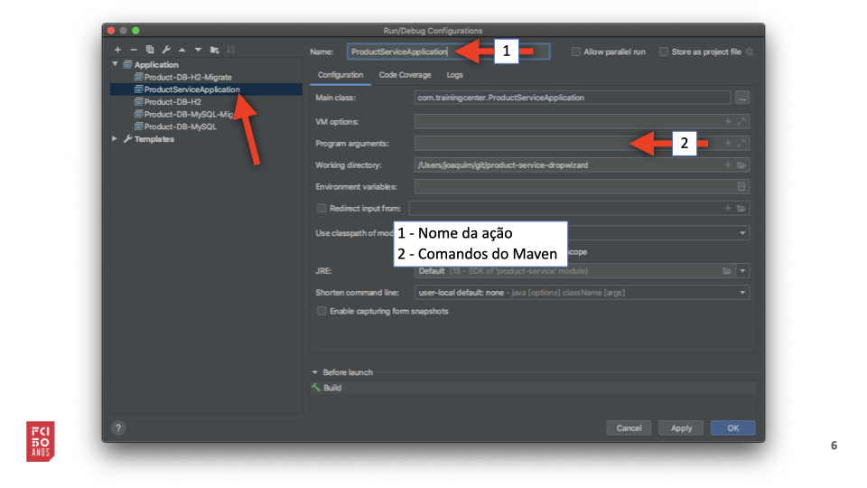
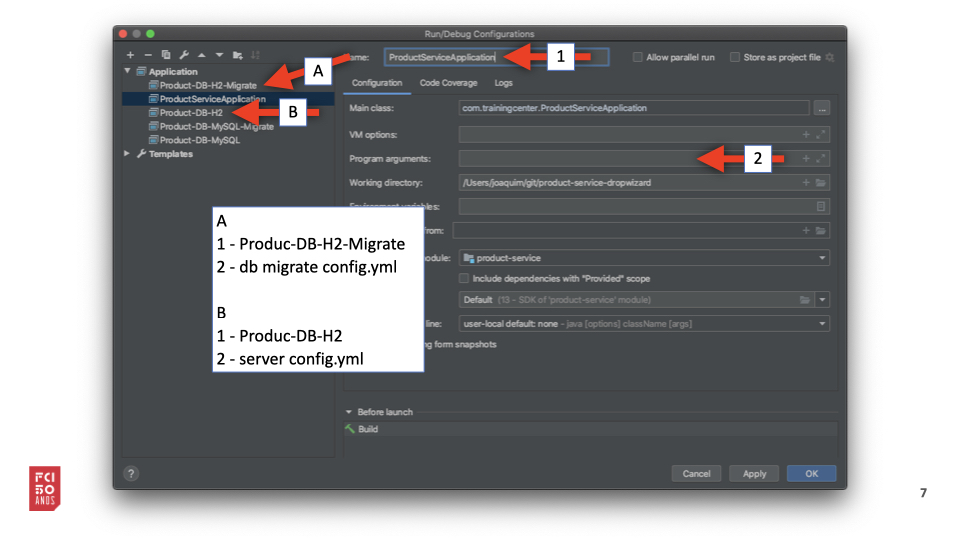
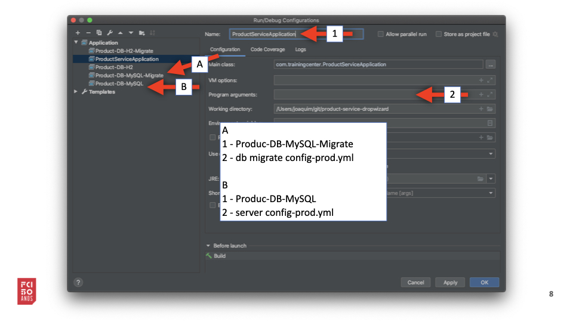

# ProductService

How to start the ProductService application
---

1. Run `mvn clean install` to build your application
1. Start application with `java -jar target/product-service-1.0-SNAPSHOT.jar server config.yml`
1. To check that your application is running enter url `http://localhost:8080`

Health Check
---

To see your applications health enter url `http://localhost:8081/healthcheck`

IntelliJ
---

`Product-DB-H2-Migrate` - execute H2 (dev) Data Base migration.

`Product-DB-H2` - start application using H2 Data Base.

`Product-DB-MySQL-Migrate` - start MySQL (prod - example) migration.

`Product-DB-MySQL` - start application using MySQL Data Base.

#### Como criar estas configurações no seu IntelliJ

